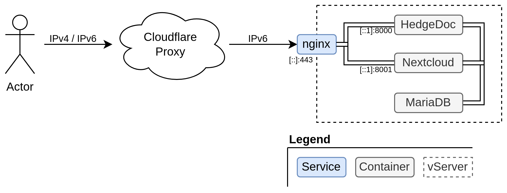

# Internal Networks

As already mentioned you can create internal networks.  
You can use these for example to enable communication with a database in a seperate service file (e.g. `/home/admin/mariadb/docker-compose.yml`).

{: loading=lazy }

You can create these internal networks by issuing the following command:
```shell
sudo docker network create --subnet 172.20.255.0/24 database
```

Your `docker-compose.yml` files may look like this:

MariaDB:  
```yaml
version: '3.9'

services:
  mariadb:
    image: mariadb   
    restart: always
    env_file: .mariadb.env
    volumes:
      - "/srv/mariadb:/var/lib/mysql"    
    networks:
      - "database"

networks:
  database:
    external: true
```

Nextcloud:  
```yaml
version: '3.9'

services:
  redis:
    image: redis
    restart: always 
    networks:
      - "default"

  nextcloud:
    image: nextcloud
    restart: always
    env_file: .nextcloud.env
    volumes:
      - "/srv/nextcloud:/var/www/html"
    ports:
      - "[::1]:8001:80"
    networks:
      - "default"
      - "database"

networks:
  default:
  database:
    external: true
```

HedgeDoc:  
```yaml
version: '3.9'

services:
  hedgedoc:
    image: quay.io/hedgedoc/hedgedoc
    restart: always
    env_file: .hedgedoc.env
    ports:
      - "[::1]:8000:3000"
    volumes:
      - "/srv/hedgedoc/uploads:/hedgedoc/public/uploads"
    networks:
      - "database"

networks:
  database:
    external: true
```
